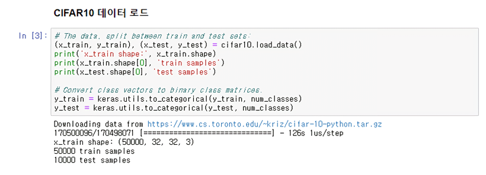
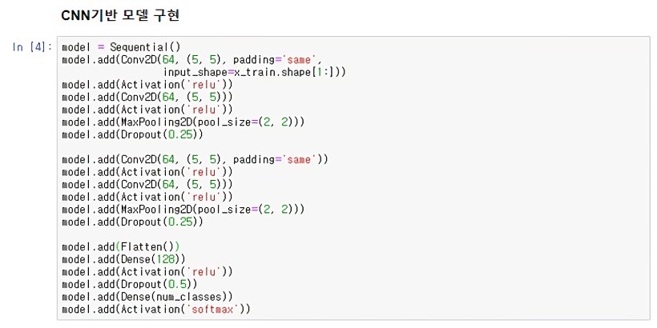
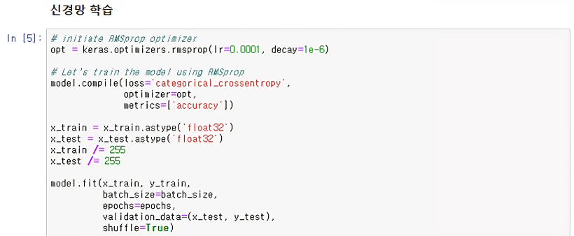
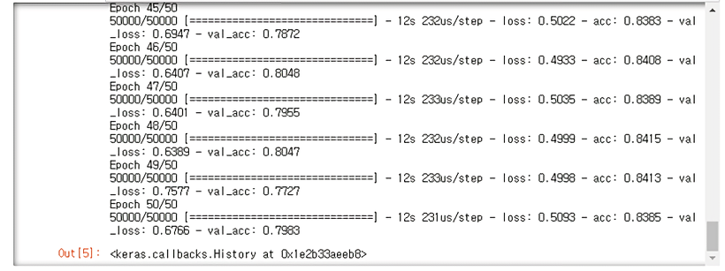
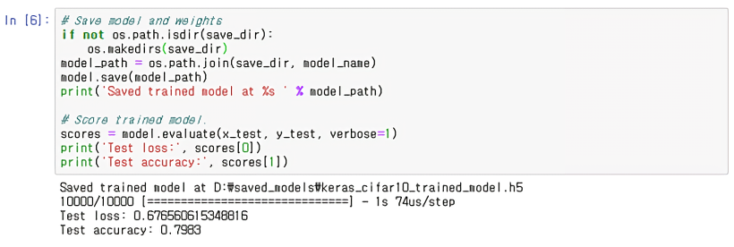
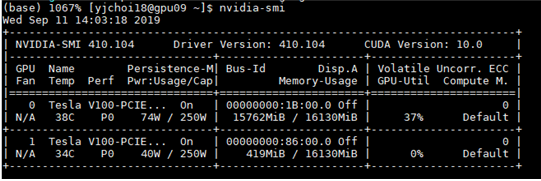
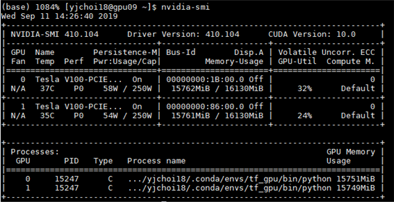

# Keras 기반 Multi GPU 사용 방법 (2020.10)

Keras(케라스)는 파이썬으로 작성된 오픈 소스 신경망 라이브러리로, MXNet, Deeplearning4j, 텐서플로, Microsoft Cognitive Toolkit 또는 Theano 위에서 수행할 수 있는 High-level Neural Network API이다. 케라스의 특징은 User friendliness, Modularity, Easy Extensibility로 Multi-GPU를 사용하고자 하는 사용자도 코드를 최소한으로 수정하여 쉽게 Multi-GPU를 사용할 수 있도록 하고 있다.

KISTI GPU 클러스터인 NEURON의 큐 구성은 다음과 같으며, ivy\_k40\_2, ivy\_v100\_2, cas\_v100\_2, cas32c\_v100\_2, cas\_v100nv\_4 큐에는 한 노드에 2, 4개의 GPU가 장착되어 있어, 단일노드를 이용할 때에도 GPU를 여러 대 사용하여 신경망 학습을 할 수 있는 환경이 구축되어 있다.


**※ 노드 구성은 시스템 부하에 따라 시스템 운영 중에 조정될 수 있음.**

**※ cas32c\_v100\_2 파티션 계산노드는 Xeon Gold 6242 CPU 2ea 탑재 (총 32코어)**

****

****

본 Multi-GPU 사용 방법 설명서에서는 CNN기반 신경망을 cifar10 데이터를 이용하여 학습하는 예제를 이용하였다.

## **1. 학습에 사용된 신경망 코드 (cifar10.py)**












## **2. 단일 GPU 사용 작업 제출 방법**

※작업제출 스크립트

```
#!/bin/sh
#SBATCH -J keras
#SBATCH --time=24:00:00
#SBATCH -o %x_%j.out
#SBATCH -e %x_%j.err
#SBATCH -p cas_v100_2
#SBATCH --comment tensorflow
#SBATCH --gres=gpu:2
#SBATCH -N 1

module load python/3.7.1
source activate tf_gpu

srun python cifar10.py
```

\- Conda를 이용하여 Keras 패키지가 설치된 tf\_gpu 가상환경을 구축하고 tf\_gpu 환경에서 수행하는 방법임. (Conda의 활용은 ‘KISTI 홈페이지 > 기술지원 > 지침서 > 소프트웨어 > Conda의 활용’ 참고.)

\- Keras는 tensorflow 위에서 동작하기 때문에 application명으로 tensorflow 사용.

\- ivy\_v100\_2노드에는 GPU가 2개 장착되어 있기 때문에 2개 GPU를 모두 사용할 수 있지만, 코드에 Multi-GPU를 사용한다고 명시하지 않았기 때문에 —gres옵션으로 gpu를 2개 사용한다고 하여도 하나의 gpu만을 사용한다는 것을 확인할 수 있음.



****

## **3. Multi-GPU 사용을 위한 코드 변경 및 작업 제출 방법**

1\) \[from keras.utils import multi\_gpu\_model] 모듈 추가

```
from __feature__ import print_function
import keras
from keras.datasets import cifar10
from keras.preprocessing.image import ImageDataGenerator
from keras.models import Sequential
from keras.layers import Dense, Dropout, Activation, Flatten
from keras.layers import Conv2D, MaxPooling2D
from keras.utils import multi_gpu_model
import os
```

2\) 코드 내 multi-gpu사용 선언

```
# initiate RMSprop optimizer
opt = keras.optimizers.rmsprop(lr=0.0001, decay=1e-6)

#multi-gpu
model = multi_gpu_model(model, gpus=2)

# Let's train the model using RMSprop
model.compile(loss='categorical_crossentropy',
optimizer=opt,
metrics=['accuracy'])
```

\-사용하고자하는 GPU 개수만큼 gpus를 설정.\
(ex. skl\_v100nv\_4노드의 경우에는 gpus=4라고 설정)


3\) Multi-GPU 사용 작업 제출 방법

※작업제출 스크립트 (단일 GPU 사용과 동일)

```
#!/bin/sh
#SBATCH -J keras
#SBATCH --time=24:00:00
#SBATCH -o %x_%j.out
#SBATCH -e %x_%j.err
#SBATCH -p cas_v100_2
#SBATCH --comment tensorflow
#SBATCH --gres=gpu:2
#SBATCH -N 1
 
module load python/3.7.1
source activate tf_gpu
 
srun python cifar10.py
```


